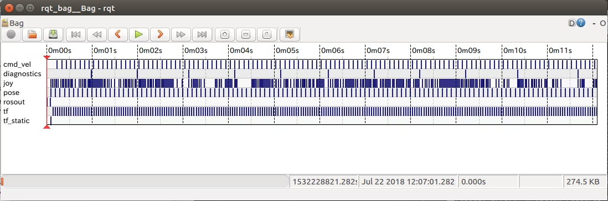
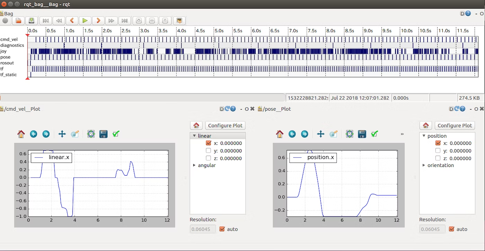

# rosbag Tutorial
- 流れているROSトピックを保存する機能がrosbagです．  
- ROSの動作はROSトピックを見れば大体はわかるので、例えばロボット実機を動かしながらrosbag記録をすることで、実機を何度も動かさなくても様々なアルゴリズムのテストをすることができます．  

- [rosbag Tutorial](#rosbag-tutorial)
    - [rosbagの取得 : `rosbag record`](#rosbagの取得--rosbag-record)
        - [`rosbag record -a`](#rosbag-record--a)
        - [`rosbag record /topic1 /topic2`](#rosbag-record-topic1-topic2)
        - [`rosbag record -e "/tf.*|/cmd_vel"`](#rosbag-record--e-tfcmdvel)
        - [おすすめの使用方法](#おすすめの使用方法)
    - [rosbagの確認 : `rosbag info`](#rosbagの確認--rosbag-info)
    - [rosbagの再生 : `rosbag play`](#rosbagの再生--rosbag-play)
        - [オプション](#オプション)
    - [rqt_bag](#rqtbag)
    - [csvへ出力](#csvへ出力)
- [Reference](#reference)

---

## rosbagの取得 : `rosbag record`
- 実行中のROSのトピック通信でのメッセージをbagファイルとして保存するコマンドが`rosbag record`です．
```python
$ cd ~/rosbag
$ rosbag record -a -O robot_bag
```
- どのトピックを保存するかを指定する方法として，以下の3通りがあります．

### `rosbag record -a`
- すべてのtopicを取得します．
- 後々に欲しいROSトピックが記録漏れをしていると悲しいので、基本的にこれを使えば良いと思います．
    - ただ画像のROSトピックは情報量が膨大になてしまいます．
    - また，ロボットを使用しているときも同様に情報量が膨大になります．
    - そのため，保存できるトピックのレートも落ちる可能性がありますので注意が必要です．

### `rosbag record /topic1 /topic2`
- トピック名を指定して特定のROSトピックを取得できます．

### `rosbag record -e "/tf.*|/cmd_vel"`
- 正規表現でマッチングしたものを記録します．

|例|意味|
|---|---|
|`/tf.*`|`/tf`と`/tf_static`を記録|
|`/group/.*`|`/group/topic1`と`/group/topic2`のように、そのネームスペース以下のものをすべて記録|
|`/topic1\|/topic2`|`/topic1と`と`/topic2を記録する`を記録|

<details><summary>その他のオプション</summary>

|例|意味|
|---|---|
|`-h`, `--help`|ヘルプを表示|
|`-a`, `--all`|全てのトピックを流れる情報を記録|
|`-e 正規表現トピック名`, `--regex=正規表現トピック名`|正規表現で名前が一致したトピックに流れる情報を記録|
|`-x 正規表現トピック名`, `--exclude=正規表現トピック名`|正規表現で名前が一致したトピックを除いたトピックに流れる情報を記録|
|`-q`, `--quiet`|コンソール出力させない|
|`-o hoge`, `--output-prefix=hoge`|hoge_YYY_MM_DD_HH_mm_ss.bagで保存|
|`-O hoge`, `--output-name=hoge`|hoge.bagで保存|
|`--split=SPLIT_SIZE`|指定された容量、周期を超えた場合、バッグを分割|
|`--max-splits=MAX_SPLITS`|最大N個のバッグファイルを保持し、最大になった時点で最も古いものを消去し、ファイル数を一定に保つ|
|`--size=SIZE`|最大サイズSIZE MBのバッグを記録(デフォルト: 無限)|
|`--duration=DURATION`|`m`または`h`が付加されていない限り、最大継続時間DURATIONのバッグを秒単位で記録|
|`-b SIZE`, `--buffize=SIZE`|SIZE MBの内部バッファを使用 (デフォルト: 256, 0 = 無限)|
|`--chunksize=SIZE`|上級者向け．SIZE KBのチャンクに記録 (デフォルト: 768)|
|`-l NUM`, `--limit=NUM`|各トピックのメッセージをNUM個だけ記録|
|`--node=NODE`|特定のノードが購読している全てのトピックを記録する|
|`-j`, `--bz2`|BZ2圧縮を使用|
|`--lz4`|LZ4圧縮を使用|
|`--tcpnodelay`|トピックを購読する際にTCP_NODELAYトランスポートヒントを使用|
|`--udp`|トピックを購読するときに UDP トランスポートヒントを使用|
|`--repeat-latched`|新しいバッグファイルの開始時にラッチされたメッセージを繰り返す|

</details>

### おすすめの使用方法
- 端末上でコマンドを`rosbag record`と打ち込んで実行するものいいですが，シェルスクリプトを作っておくと便利です．
- 例えば，`/odom`と`/cmd_vel_mux/input/teleop`を記録する場合，以下のようにシェルスクリプトを作成します．

<details><summary>rosbag_record.sh</summary>

- [rosbag_record.sh](bash/rosbag_record.sh)

```bash
#!/bin/bash

rosbag_file="my_bag"
if [ $# = 0 ]; then
    echo "rosbag file name = " $rosbag_file
else
    echo "rosbag file name = " $1
    rosbag_file=$1
fi

cd ~/catkin_ws/src
rosbag record   /odom \
                /cmd_vel_mux/input/teleop  \
                -o $rosbag_file
```

</details>

- [トップに戻る](#rosbag-tutorial)

---

## rosbagの確認 : `rosbag info`
```python
$ rosbag info robot_bag.bag

ros_lecture@ubuntu:~/rosbag$ rosbag info robot_bag.bag 
path:        robot_bag.bag
version:     2.0
duration:    22.4s
start:       Jul 22 2018 11:49:05.63 (1532227745.63)
end:         Jul 22 2018 11:49:28.08 (1532227768.08)
size:        542.8 KB
messages:    2404
compression: none [1/1 chunks]
types:       diagnostic_msgs/DiagnosticArray [60810da900de1dd6ddd437c3503511da]
             geometry_msgs/Pose              [e45d45a5a1ce597b249e23fb30fc871f]
             geometry_msgs/Twist             [9f195f881246fdfa2798d1d3eebca84a]
             rosgraph_msgs/Log               [acffd30cd6b6de30f120938c17c593fb]
             sensor_msgs/Joy                 [5a9ea5f83505693b71e785041e67a8bb]
             tf2_msgs/TFMessage              [94810edda583a504dfda3829e70d7eec]
topics:      /cmd_vel        222 msgs    : geometry_msgs/Twist
             /diagnostics     22 msgs    : diagnostic_msgs/DiagnosticArray
             /joy           1479 msgs    : sensor_msgs/Joy
             /pose           222 msgs    : geometry_msgs/Pose
             /rosout          13 msgs    : rosgraph_msgs/Log               (4 connections)
             /tf             445 msgs    : tf2_msgs/TFMessage
             /tf_static        1 msg     : tf2_msgs/TFMessage
```

<details><summary>その他のオプション</summary>

|例|意味|
|---|---|
|`-h`, `--help`|ヘルプを表示|
|`-y`, `--yaml`|YAMLフォーマットで情報を表示|
|`-k KEY`, `--key=KEY`|与えられたキーに関する情報を表示|
|`--freq`|トピックメッセージの頻度統計を表示|

</details>

- [トップに戻る](#rosbag-tutorial)

---

## rosbagの再生 : `rosbag play`
```bash
$ cd ~/rosbag
$ rosbag play robot_bag.bag --rate=2.0 --clock --loop
```

### オプション

|例|意味|
|---|---|
|`-h`, `--help`|ヘルプを表示|
|`-p PREFIX`, `--prefix=PREFIX`|すべての出力トピックに接頭辞を付ける|
|`-q`, `--quiet`|コンソール出力させない|
|`-i`, `--immediate`|全てのメッセージを待たずに再生|
|`--pause`|一時停止モードで起動|
|`--queue=SIZE`|`SIZE`の送信キューを使用(デフォルトは100)|
|`--clock`|時計の時刻を公開 **(TF使用時は必須)**|
|`--hz=HZ`|時計の時間を公開するときに`HZ`の周波数(デフォルトは100)|
|`-d SEC`, `--delay=SEC`|トピックのコールバック後に`SEC`秒スリープする（サブスクライバが接続できるようにするため）|
|`-r FACTOR`, `--rate=FACTOR`|発行レートに`FACTOR`を掛ける|
|`-s SEC`, `--start=SEC`|rosbagの再生を`SEC`秒後開始します|
|`-u SEC`, `--duration=SEC`|rosbagの再生を`SEC`秒間行います|
|`--skip-empty=SEC`|`SEC`秒以上メッセージのない領域をスキップ|
|`-l`, `--loop`|ループ再生|
|`-k`, `--keep-alive`|rosbagの終わりまで生き続ける(ラッチされたトピックを公開するのに有効)|
|`--try-future-version`|プレーヤーがバージョン番号を知らない場合でも、Bagファイルを開こうとする|
|`--topics=/topic1`|再生するトピック|
|`--pause-topics`|再生中に一時停止するトピック|
|`--bags=BAGS`|再生するBagファイル|
|`--wait-for-subscribers`|各トピックに最低1人の購読者がいることを確認してから公開する|
|`--rate-control-topic=RATE_CONTROL_TOPIC`|与えられたトピックを監視し、もし最後の公開が`RATE_CONTROL_TOPIC`以上前に公開された場合は、そのトピックが再び公開されるまで待ちます．トピックが再び公開されるまで待ち、再生を継続します．|
|`--rate-control-max-delay=RATE_CONTROL_MAX_DELAY`|`RATE_CONTROL_MAX_DELAY`からの最大時間差 から一時停止するまでの最大時間差|

- [トップに戻る](#rosbag-tutorial)

---

## rqt_bag
- 以下のコマンドを実行すると以下のようなウィンドウが出てきます．
- 縦にrosbagに入っているROSトピックが並んでいて、青い縦線はその時間にpublishされたことを示します．
```bash
$ cd ~/rosbag
$ rqt_bag robot_bag.bag
```
<div align="center">
    
</div>

- 各トピックを右クリックしてview->plotを選択するとグラフの表示ができます．
- これで各データを見比べたりできます．
<div align="center">
    
</div>

- [トップに戻る](#rosbag-tutorial)

---

## csvへ出力
- rosbagで記録したトピックをcsvファイルに保存することが出来ます
```bash
$ rostopic echo -b bagファイル.bag -p /トピック名 > csvファイル.csv
```
- シェルスクリプトを作っておくと便利です．
- 例えば，`/cmd_vel_mux/input/teleop`と`/odom/twist/twist`をcsvファイルに記録する場合，以下のようにシェルスクリプトを作成します．

<details><summary>bag2csv.sh</summary>

- [bag2csv.sh](bash/bag2csv.sh)
```bash
#!/bin/bash

cd ~/catkin_ws/src
# csvを作るrosbagファイル
rosbag_files=(
    "my_bag_1" \
    "my_bag_2" \
    "my_bag_3"
)

for ((i = 0; i < ${#rosbag_files[@]}; i++)) {
    echo "${rosbag_files[i]}"
    rostopic echo -b ${rosbag_files[i]}.bag -p /cmd_vel_mux/input/teleop  > teleop_${rosbag_files[i]}.csv
    rostopic echo -b ${rosbag_files[i]}.bag -p /odom/twist/twist> odom_velocity_${rosbag_files[i]}.csv
}
```

</details>

- [トップに戻る](#rosbag-tutorial)

---

# Reference
- [ROS講座29 rosbagを使う](https://qiita.com/srs/items/f6e2c36996e34bcc4d73)
- [ROSのbagファイルから特定トピックをcsv形式で出力する](https://yura2.hateblo.jp/entry/rosbag-to-csv)
- [ROSのbagファイルのトピックを簡単にフィルタリングするGUIツールを作った](https://myenigma.hatenablog.com/entry/2016/02/09/223403)
- [コマンドリファレンス（アルファベット順）](http://forestofazumino.web.fc2.com/ros/ros_command_reference.html)

- [トップに戻る](#rosbag-tutorial)

---
